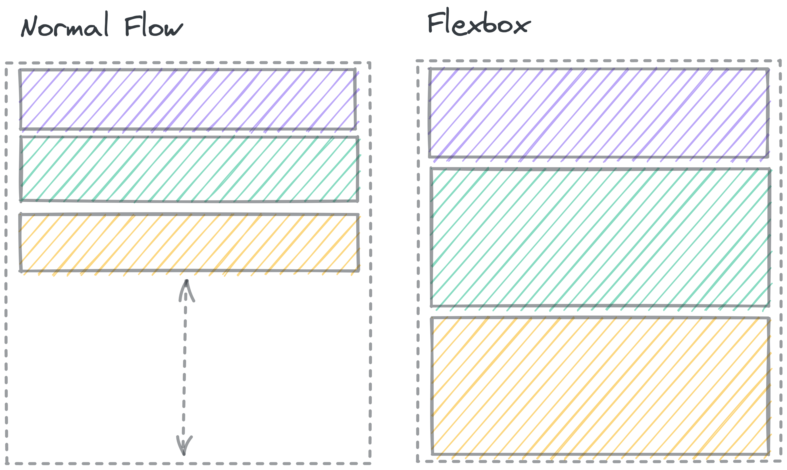
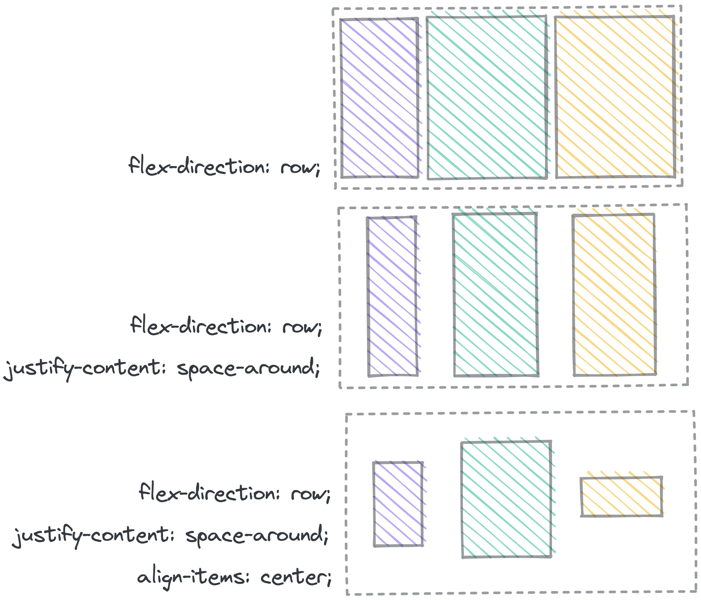

# Flexbox

If an element has `display: flex`, the child elements inside won't follow the
normal flow rules. Instead, they follow a whole different set of rules: the
**flex rules**.

<aside>

 🎥 **Video: Learn Flexbox**

This video from Web Dev Simplified shows the main ideas of Flexbox.

<iframe src="https://www.youtube.com/embed/fYq5PXgSsbE" title="YouTube video player" frameborder="0" allow="accelerometer; autoplay; clipboard-write; encrypted-media; gyroscope; picture-in-picture" allowfullscreen style="position: absolute; top: 0; left: 0; width: 100%; height: 100%;"></iframe>

</aside>

The basic idea of Flexbox is that the items *flex* (expand) to fill additional space or shrink to fit into smaller spaces.

The dashed line shows a container element. In Normal flow, there’s space below the block elements inside the container. In a Flexbox, the elements grow to fill the whole space.

If you set an element to `display: flex;`, it acts on the outside like a regular block element. On the inside, elements no longer follow _Normal flow_. Instead, that element becomes a **flex container**, and the items inside get laid out according to the flexbox rules.

Flexbox gives you lots of tools to change the way the elements move to fill the space.

You can change:

- The **direction** of the box (columns or rows)
- The **space** between items
- The horizontal and vertical **alignment** of the elements within the box
- Whether or not elements will **wrap** around if they get crowded
- Which elements **grow** and **shrink**, and by how much

> **Further Reading**: Flexbox
>
> [MDN’s page on Flexbox](https://developer.mozilla.org/en-US/docs/Learn/CSS/CSS_layout/Flexbox) goes into great detail about the details of how Flexbox works.

## Practice: Flexbox Froggy

<aside>

🐸 Go to **[Flexbox Froggy](https://flexboxfroggy.com/)** and try to get through all the levels, to learn how to use the different flex properties.

It lets you learn the different flex properties by moving frogs onto lily pads. Very cute. 🐸

</aside>
