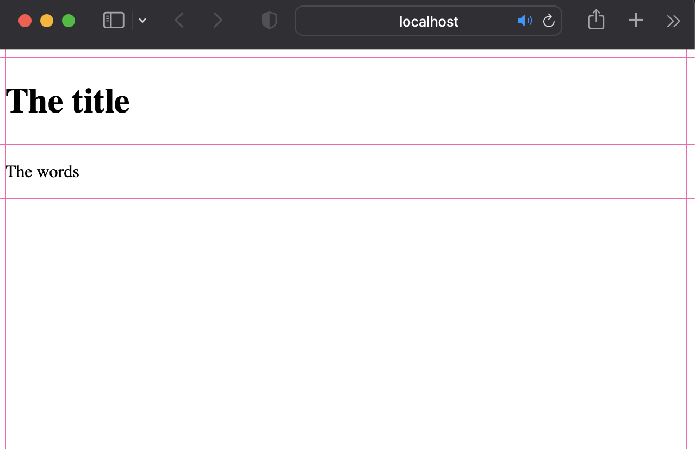
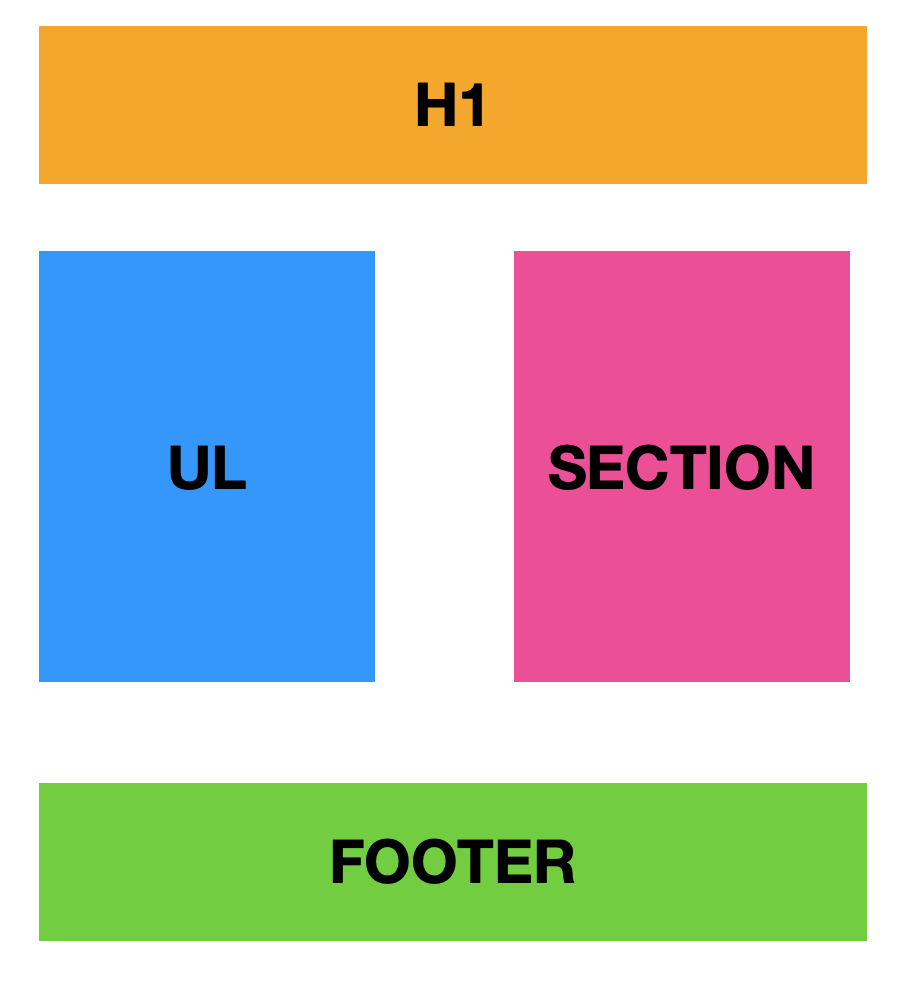
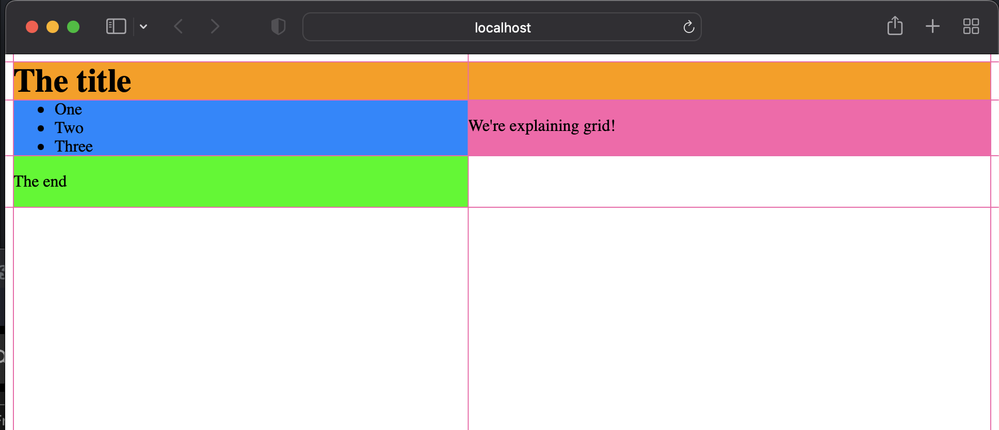
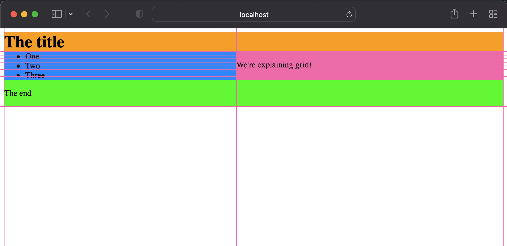
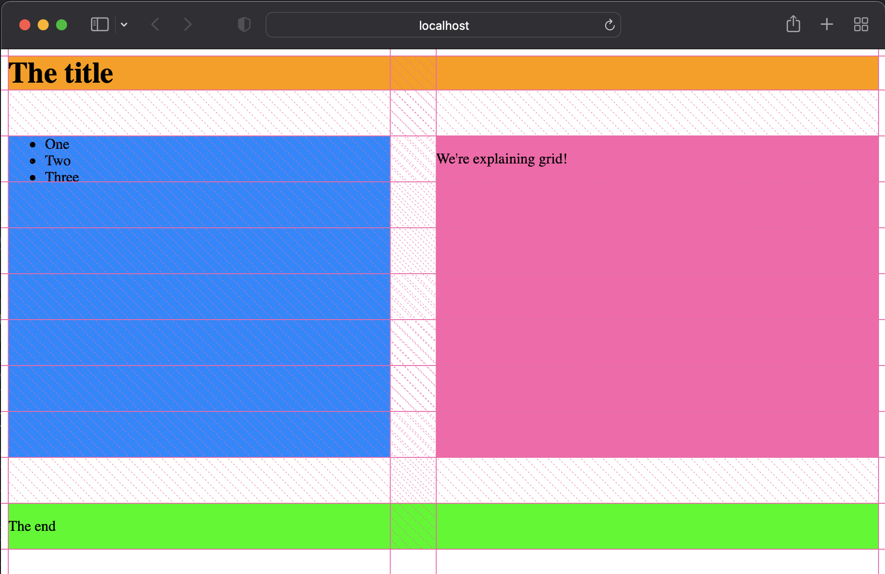

# CSS Grid

CSS-Grid is a layout framework native to CSS, it's a way to position elements on a page consistently while taking 
the device width and height into account.

<aside>

 🎥 **Video: Basics of CSS Grid: The Big Picture**

Watch Jen Simmons explain in detail what CSS Grid is and how we can use it within our web apps and sites.

<div style="position: relative; padding-bottom: 56.25%; height: 0;"><iframe src="https://www.youtube.
com/embed/FEnRpy9Xfes" title="YouTube video player" frameborder="0" allow="accelerometer; autoplay; clipboard-write; encrypted-media; gyroscope; picture-in-picture" allowfullscreen  style="position: absolute; top: 0; left: 0; width: 100%; height: 100%;"></iframe></div>

</aside>

That video contained a lot of information! So let's highlight the important bits:
- CSS Grid is a way to structure elements on the web page.
- A grid container is the parent elements and contains the grid items.
- A grid item is the child element and lives inside the grid container.
- The grid only applies to the grid items, not the elements inside a grid item.
The grid container and grid item are structured like this:
```html
    <main> <!-- This is a grid container -->
        <h1>The title</h1> <!-- This is a grid item -->
        <ul> <!-- This is a grid item -->
            <li>One</li> <!-- This is NOT a grid item -->
            <li>Two</li> <!-- This is NOT a grid item -->
            <li>Three</li> <!-- This is NOT a grid item -->
        </ul>
        <section> <!-- This is a grid item -->
            <p>We're explaining grid!</p> <!-- This is NOT a grid item -->
        </section>
        <footer> <!-- This is a grid item -->
            <p>The end</p> <!-- This is NOT a grid item -->
        </footer>
    </main>
```
- There can be multiple grid elements on a page.
- A 1x1 unit in a grid is a cell
- A collection of cells is a grid area
- A grid row is the horizontal direction of the grid
- A grid column is the vertical direction of the grid
- A grid gap is the space between grid cells, you can't put elements in grid gaps
- There are lines that define the boundaries of the cells, and they’re numbered

## The Syntax

We can define a grid in CSS by specifying the display rule on the element. So if we use the HTML from above, we can 
have CSS that looks like this:

```css
    main {
      display: grid;
    }
```
You may not notice a difference immediately but if you inspect the web page, you will see that the `main` element 
does have a display of `grid` and you can switch on the grid outlines to show you where the lines, rows and columns are.


So now let's position our grid items the way we want on the page. I want my `h1` to be at the very top then my `ul` 
and my `section` to be side by side and then my footer to be below everything. It should look like this:


First, let's position the `h1`, since it's already the first grid item and I want it to be on it's own row, I can 
rely on the browser to display the default, but I want to make sure it'll span the length of the row. So I should 
define that explicitly:

```css
    h1 {
      grid-column-start: 1;
      grid-column-end: 3;
    }
```
See how the `h1` now spans across the length of the page? This is how we explicitly define the width of the 
grid-area. I haven't defined the height of the area because I'm relying on the implicit grid, which by default will 
only take the space of one row.


Now it's time for the `ul` and the `section`. Remember: the elements within the `ul` and `section` aren't grid items!

```css
    ul {
        grid-column-start: 1;
        grid-column-end: 2;
        grid-row-start: 2;
        grid-row-end: 10;
    }
    
    section {
        grid-column-start: 2;
        grid-column-end: 3;
        grid-row-start: 2;
        grid-row-end: 10;
    }
```
For each element, I have to define which line I want the start and end my column and which lines I want to start and 
end my row, so using the line numbers, and the `start` and `end` suffixes for both the columns and rows, I can 
define the grid-area for these elements. Now the page looks like this:


So now, the `footer` needs to be the same width as the `h1`, just like in our diagram, and for that, we can copy the 
rules for the `h1`

```css
    footer {
      grid-column-start: 1;
      grid-column-end: 3;
    }
```


We're almost done but there's still something missing. Most of the elements are touching since they start from the 
same lines. We should add a grid gap to the grid container so that there's a little more space between the elements.

```css
    main {
      display: grid;
      grid-gap: 50px;
   }
```


That's it!

## Practice: Outline the Grid

<aside>

Have a look at this screenshot of the Kibo School homepage


Outline the grid on the page, assuming there is only one grid. You should:
- draw the grid lines
- number the grid lines
- highlight any grid gaps
- label the grid columns
- label the grid rows
</aside>
